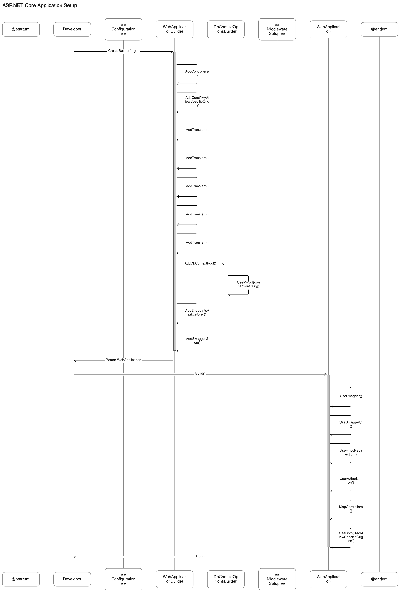
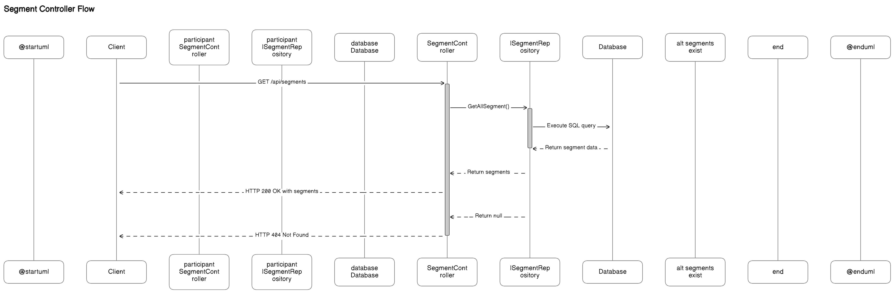
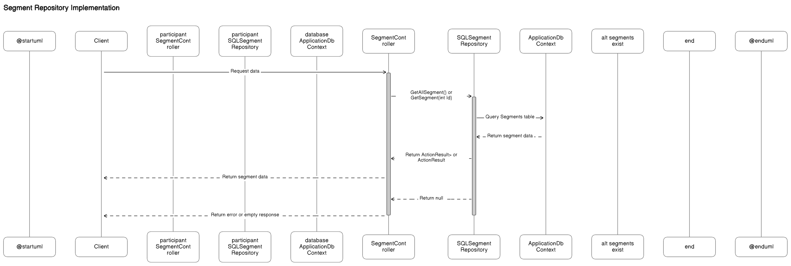
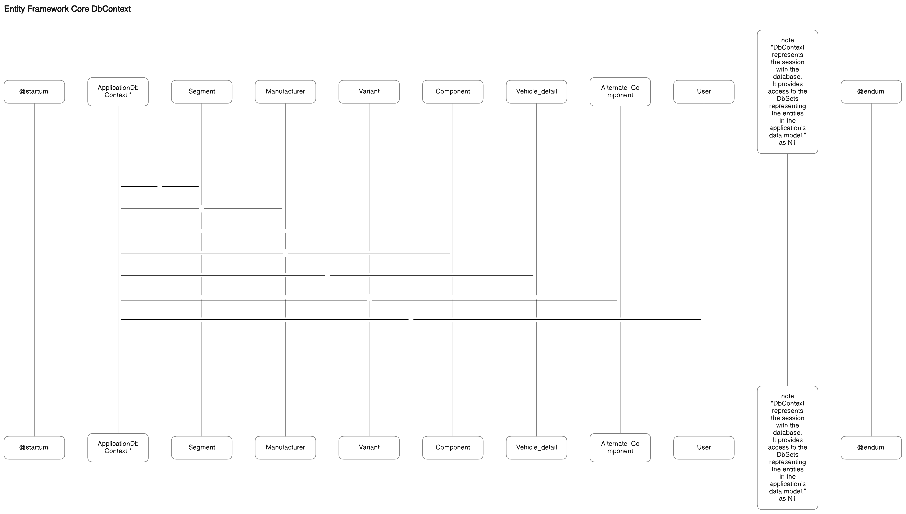

```c#
using demo1.Repositories;
using Microsoft.EntityFrameworkCore;
using System;
using Vehical_config_1.Repository;
using Vehicle.Models;

namespace Vehicle
{
    public class Program
    {
        public static void Main(string[] args)
        {
            var builder = WebApplication.CreateBuilder(args);

            // Add services to the container.

            builder.Services.AddControllers();
            builder.Services.AddCors(options =>
            {
                options.AddPolicy("MyAllowSpecificOrigins",
                    builder =>
                    {
                        builder.WithOrigins("*")
                               .AllowAnyHeader()
                               .AllowAnyMethod();
                    });
            });
            builder.Services.AddTransient<IVehicleDetail,SqlVehicleDetailRepository>(); 
            builder.Services.AddTransient<ISegmentRepository,SQLSegmentRepository>();
            builder.Services.AddTransient<IAlternateComponent, SqlAlternateComponentRepo>();
            builder.Services.AddTransient<IManufacturerRepository,SQLManufacturerRepository>();
            builder.Services.AddTransient<IVariantRepository,SQLVariantRepository>();
            //builder.Services.AddTransient<IUserRepository, SQLUserRepository>();


            builder.Services.AddDbContextPool<ApplicationDbContext>((options, context) =>
            {
                var connectionString = builder.Configuration.GetConnectionString("DefaultConnection");
                context.UseMySql(connectionString, ServerVersion.AutoDetect(connectionString));

            });

            // Learn more about configuring Swagger/OpenAPI at https://aka.ms/aspnetcore/swashbuckle
            builder.Services.AddEndpointsApiExplorer();
            builder.Services.AddSwaggerGen();

            var app = builder.Build();

            // Configure the HTTP request pipeline.
            if (app.Environment.IsDevelopment())
            {
                app.UseSwagger();
                app.UseSwaggerUI();
            }

            app.UseHttpsRedirection();

            app.UseAuthorization();


            app.MapControllers();
            app.UseCors("MyAllowSpecificOrigins");

            app.Run();
        }
    }
}
```

# Application Initialization Process

This diagram illustrates the following steps involved in the initialization process of the application:

1. The Developer initiates the application by calling `WebApplication.CreateBuilder(args)`.

2. The `WebApplicationBuilder` is configured with various services:

   - `AddControllers()` to enable MVC controllers
   - `AddCors()` to configure CORS policy
   - `AddTransient<>()` to register various repositories as transient services
   - `AddDbContextPool<ApplicationDbContext>()` to configure the DbContext using MySQL
   - `AddEndpointsApiExplorer()` and `AddSwaggerGen()` to enable Swagger

3. The `WebApplication` is built from the configured `WebApplicationBuilder`.

4. The `WebApplication` is configured with various middleware:

   - `UseSwagger()` and `UseSwaggerUI()` to enable Swagger UI
   - `UseHttpsRedirection()` to redirect HTTP requests to HTTPS
   - `UseAuthorization()` to enable authorization
   - `MapControllers()` to map routes to controllers
   - `UseCors()` to apply the CORS policy

5. Finally, the `WebApplication` is run, starting the application.

This sequence of steps ensures the proper configuration and setup of the application for seamless execution.

```c#
using demo1.Models;
using demo1.Repositories;
using Microsoft.AspNetCore.Mvc;


// For more information on enabling Web API for empty projects, visit https://go.microsoft.com/fwlink/?LinkID=397860

namespace Vehical_config_1.Controllers
{
    [Route("api/segments")]
    [ApiController]
    public class SegmentController : ControllerBase
    {
        private readonly ISegmentRepository _repo;

        public SegmentController(ISegmentRepository repository)
        {
            _repo = repository;
        }

        // GET: api/<SegmentController>
        [HttpGet]

        public async Task<ActionResult<IEnumerable<Segment>?>> GetSegment()

        {
            if (await _repo.GetAllSegment() == null)
            {
                return NotFound();
            }

            return await _repo.GetAllSegment();

        }


    }
}

```


# Segment Retrieval Flow

This diagram illustrates the flow of data in the process of retrieving segments from the application:

1. The **Client** sends a GET request to the **SegmentController** at the `/api/segments` endpoint.

2. The **SegmentController** is activated and calls the `GetAllSegment()` method on the **ISegmentRepository** instance.

3. The **ISegmentRepository** is activated and interacts with the **Database** to execute a SQL query and retrieve segment data.

4. The **Database** returns the segment data to the **ISegmentRepository**.

5. If segments exist, the **ISegmentRepository** returns the segments to the **SegmentController**.

6. The **SegmentController** returns an HTTP 200 OK response with the segments to the **Client**.

7. If no segments exist, the **ISegmentRepository** returns null to the **SegmentController**.

8. The **SegmentController** returns an HTTP 404 Not Found response to the **Client**.

## Components and Responsibilities:

- **SegmentController:** Handles the HTTP request and response, and interacts with the repository to retrieve data.

- **ISegmentRepository:** Abstracts the data access logic and interacts with the database to retrieve segment data.

- **Database:** Stores and retrieves the segment data.

## Key Points:

- The flow demonstrates the separation of concerns, with each component having a distinct role in the process.

- Dependency injection is employed to inject the **ISegmentRepository** instance into the **SegmentController**, promoting loose coupling and testability.

In an interview setting, this diagram can be utilized to explain the intricacies of the data retrieval process, the role of each component, and the design principles employed for maintainability and testability.


```C#
using demo1.Models;
using Microsoft.AspNetCore.Mvc;

namespace demo1.Repositories
{
    public interface ISegmentRepository
    {
        Task<ActionResult<Segment>?> GetSegment(int Id);
        Task<ActionResult<IEnumerable<Segment>>> GetAllSegment();
    }
}

using Microsoft.AspNetCore.Mvc;
using Microsoft.EntityFrameworkCore;
using demo1.Models;
using Vehicle.Models;
using demo1.Repositories;

namespace Vehical_config_1.Repository
{
    public class SQLSegmentRepository : ISegmentRepository
    {
        private readonly ApplicationDbContext context;

        public SQLSegmentRepository(ApplicationDbContext context)
        {
            this.context = context;
        }

        public async Task<ActionResult<IEnumerable<Segment>>> GetAllSegment()
        {
            if (context.Segments == null)
            {
                return null;
            }
            return await context.Segments.ToListAsync();


        }

        public async Task<ActionResult<Segment>?> GetSegment(int Id)
        {
            var segment = await context.Segments.FindAsync(Id);

            if (segment == null)
            {
                return null;
            }

            return new ActionResult<Segment>(segment);
        }


    }
}

```


# Data Retrieval Flow with SQLSegmentRepository

This diagram illustrates the process of data retrieval from the `SQLSegmentRepository` through the `SegmentController`:

1. The **Client** requests data from the **SegmentController**.

2. The **SegmentController** calls either the `GetAllSegment()` or `GetSegment(int Id)` method on the **SQLSegmentRepository**.

3. The **SQLSegmentRepository** is activated and queries the `Segments` table in the `ApplicationDbContext` database.

4. The **ApplicationDbContext** returns the segment data to the **SQLSegmentRepository**.

5. If segments exist, the **SQLSegmentRepository** returns an `ActionResult<IEnumerable<Segment>>` or `ActionResult<Segment>` to the **SegmentController**.

6. The **SegmentController** returns the segment data to the **Client**.

7. If no segments exist, the **SQLSegmentRepository** returns null to the **SegmentController**.

8. The **SegmentController** returns an error or an empty response to the **Client**.

## Implementation Details:

- **Separation of Concerns:** The repository pattern separates the data access logic from the controller, promoting better code organization and maintainability.

- **Dependency Injection:** The **SQLSegmentRepository** depends on the **ApplicationDbContext**, which is injected through its constructor, following the Dependency Inversion Principle.

- **Data Access Layer:** The **SQLSegmentRepository** acts as the data access layer, interacting with the database through the **ApplicationDbContext** and executing queries to retrieve segment data.

- **Error Handling:** The repository handles cases where no segments are found and returns appropriate null or error responses to the controller.

- **Entity Framework Core Integration:** The repository leverages Entity Framework Core to interact with the database and execute queries on the `Segments` table.

## Advantages of Repository Pattern:

- Improved Testability: The separation of concerns makes it easier to unit test components in isolation.

- Better Code Organization: The repository pattern organizes code in a way that enhances maintainability and readability.

- Flexibility: The ability to swap out the data access implementation without affecting the rest of the application provides flexibility for future changes.

In an interview setting, this diagram can be used to discuss the detailed implementation of the repository pattern, its advantages, and the considerations made in the design of the data access layer.

```C#
using demo1.Models;
using Microsoft.EntityFrameworkCore;

namespace Vehicle.Models
{
    public class ApplicationDbContext : DbContext
    {
        public ApplicationDbContext(DbContextOptions<ApplicationDbContext> options) : base(options) { }

        public DbSet<Segment> Segments { get; set; }
        public DbSet<Manufacturer> Manufacturers { get; set; }
        public DbSet<Variant> Variants { get; set; }
        public DbSet<Component> Components { get; set; }
        public DbSet<Vehicle_detail> Vehicle_Details { get; set; }
        public DbSet<Alternate_Component> Alternate_Components { get; set;}
        public DbSet<User> Users { get; set; }
    }
}


```

# ApplicationDbContext in Entity Framework Core

The `ApplicationDbContext` class plays a crucial role in managing the interaction between the application's domain model and the underlying database using Entity Framework Core. Here are several aspects to consider:

## DbContext:

The `ApplicationDbContext` class is a subclass of the DbContext class from Entity Framework Core. It serves as a bridge, facilitating communication between the application and the database.

## DbSet Properties:

The `ApplicationDbContext` includes several DbSet properties, each representing a collection of entities in the application's data model. These properties offer a way to query and manipulate the corresponding entity types in the database.

## Entity Types:

The DbSet properties in the `ApplicationDbContext` align with entity types in the application's domain model. Examples of entity types include Segment, Manufacturer, Variant, Component, Vehicle_detail, Alternate_Component, and User.

## Database Session:

The `ApplicationDbContext` represents a session with the database. It provides the functionality to perform CRUD operations (Create, Read, Update, Delete) on entities within the data model.

## Database Context Configuration:

The `ApplicationDbContext` constructor takes DbContextOptions<ApplicationDbContext> as a parameter. This parameter is used for configuring the database connection string and other settings related to the database context.

## Separation of Concerns:

By having a dedicated `ApplicationDbContext` class, the application follows the principle of Separation of Concerns. This separation isolates the responsibility of managing the database session and entity access from the rest of the application logic.

## Code-First Approach:

The `ApplicationDbContext` is commonly used in a Code-First approach. In this approach, the database schema is generated from the entity classes and the configuration provided in the DbContext, emphasizing the design of the application's domain model before defining the database schema.

In an interview, it is essential to highlight the importance of the `DbContext` in Entity Framework Core, its role in data access, and how it contributes to a well-organized and maintainable application architecture. Additionally, discussing the benefits of using a Code-First approach for database schema management can provide valuable insights into the design choices made in the application.

```C#
using System.ComponentModel.DataAnnotations;
using System.ComponentModel.DataAnnotations.Schema;

namespace demo1.Models
{
    [Table("Segment")]
    public class Segment
    {
        [Key]
        [DatabaseGenerated(DatabaseGeneratedOption.Identity)]
        public int Seg_id { get; set; }
        public string Seg_name { get; set; }
        public int Qty { get; set; }

        public ICollection<Manufacturer> Manufacturers { get; set; }
        public ICollection<Variant> Variants { get; set; }
    }
}

```

# Segment Class Entity Model

This diagram illustrates the structure and relationships of the `Segment` class, representing an entity model in the application's domain.

## Entity Model:

- The `Segment` class is a model or entity in the application's domain, encapsulating properties that correspond to columns in the associated database table.

- The class includes the following properties:
  - **Seg_id (int):** A primary key property annotated with `[Key]` and `[DatabaseGenerated(DatabaseGeneratedOption.Identity)]` to indicate it's an auto-incrementing primary key column.
  - **Seg_name (string):** A property representing the name of the segment.
  - **Qty (int):** A property representing the quantity of the segment.
  - **Manufacturers (ICollection<Manufacturer>):** A navigation property representing the one-to-many relationship between `Segment` and `Manufacturer` entities.
  - **Variants (ICollection<Variant>):** A navigation property representing the one-to-many relationship between `Segment` and `Variant` entities.

## Data Annotations:

- The `Segment` class uses Data Annotations to configure the mapping between the entity and the corresponding database table:
  - `[Table("Segment")]` specifies the name of the associated database table.
  - `[Key]` and `[DatabaseGenerated(DatabaseGeneratedOption.Identity)]` define the primary key property and its auto-incrementing nature.

## Relationships:

- The diagram visually represents the one-to-many relationships between `Segment` and `Manufacturer` (Manufacturers) and between `Segment` and `Variant` (Variants), denoted by the multiplicity indicators ("1" and "0..*").

## Object-Relational Mapping (ORM):

- The `Segment` class is designed to work seamlessly with an Object-Relational Mapping (ORM) tool, such as Entity Framework Core.

- The ORM maps class properties to corresponding database columns and manages the serialization and deserialization of data between the application and the database.

## Domain Modeling:

- The `Segment` class exemplifies how the application's domain is modeled using classes and properties.

- This encapsulation of business logic and data structures contributes to a clear representation of the application's core entities.

In an interview, this diagram serves as a valuable visual aid to explain the entity model, the use of Data Annotations, relationships, and the broader concepts of Object-Relational Mapping and domain modeling within the application.
